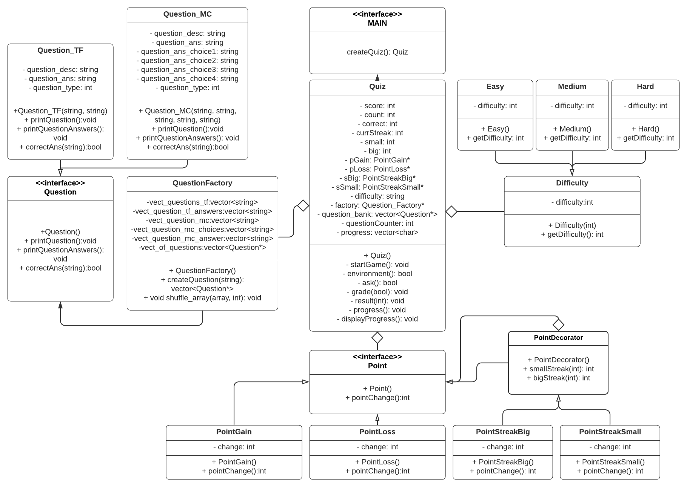
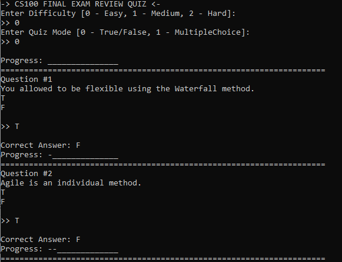
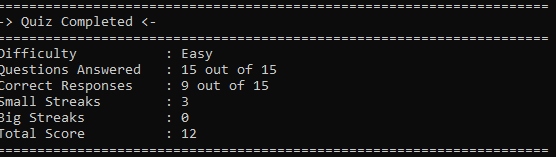

# CS 100 Programming Project

Dennis Vuong - dvuon015@ucr.edu

Yong Hwei Toon - ytoon001@ucr.edu

# CS 100 Quiz App
We're planning to work on a quiz app based on the material we learn in CS100. The goal of this app is for us to apply the techniques we learn in CS100 as well as master them. This quiz style app is important because it will allow us to do well in this course as we'll be using this to study. We're excited about this because hopefully we'll be able to share this with our classmates if we finish the project fast enough. 

We plan to create this app in C++ and depending on the time frame we might try to add a graphical user interface into our project. For the technologies and tools used for this app's development would be Github, Vim, CMake, GoogleTest and some GUI framework if time allows us.

The input for the app would be input from the user as they would choose from a series of multiple choice answers for a question that displays on the screen. Depending on the types of design patterns we need to implement we might derive from the original plan and and more features. The output of the app would be an indication of whether or not the user got a question correct.

Overall we're focusing more on the design patterns, usage of Github and agile techniques to make our project a success.

# UML Diagram


# Description
For our project, we're incorportating the strategy, decorator and factory pattern into our application. The Factory pattern will be used to construct the questions. There are two types of questions true / false questions and multiple choice. We're using the Decorator pattern for our point system. The basic point gain and loss are there but there's also a special streak which is our decorator. Finally, we're using difficulty modes which varies from easy, medium, and hard which will come from the strategy pattern. These modes will have impact on the point system. Overall, our project will consist and work together with the strategy, decorator and factory pattern.

# How to Run CS100 Quiz App
1) Have C++11 and CMake and Make Installed on Machine. Type in these commands in your terminal.
2) ```git clone --recursive https://github.com/cs100/final-project-dennis_david.git```
3) ```cd final-project-dennis_david```
4) ```cmake3 .```
5) ```make```
6) ```./main```

Using these steps provided you'll be able to run the program.

# Point System
There are 3 difficulty modes for the application. Easy, Medium and Hard. These modes influence the point system. Easy Mode will allow users to lose 0 points if they answer a question incorrectly. Medium will subtract 1 point for missed question. Hard will substract 2 points for missed question. There are streaks for getting multiple questions right which will impact points gained. By getting 3 questions correctly in a row, users will be able to gain 2 points per question correctly until they answer a question incorrectly. There's an even bigger streak of 5 which will give 3 points per questions with the same respective rules as the smaller streak. For non streak related correct answers it will be 1 point.

To recap:

3 Ans Correct = Small Streak which gives 2 points per question

5 Ans Correct = Big Streak which gives 3 points per question

Hard = -2 points on incorrect answer

Medium = -1 points on incorrect answer

Easy = 0 points on incorrect answer

# More about our program
Our program is simple and used in terminal. It takes in keyboard inputs and will output the correct answer to the respective question. It has a progress bar letting you know your track record. 


This picture shows the beginning of our program. 
It has multiple questions similar to the ones you see.

After completetion of the program you'll see something like this:


This indicates your results and how you did. 

There isn't anything really complicated with our program. We wanted to show proficiency in implementing the factory, decorator and strategy design patterns.


